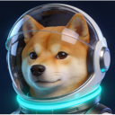

# Dogendary Wallet 🐕

<p align="center">
  
</p>

<p align="center">
  <strong>The Dogendary Dogecoin & Doginals Browser Extension Wallet</strong>
</p>

<p align="center">
  Built with ❤️ by <a href="https://24hrmvp.xyz">24HRMVP</a>
</p>

---

## ✨ Features

### Core Wallet
- 🔐 **HD Wallet** - BIP44 derivation (m/44'/3'/0'/0/x) for Dogecoin
- 🔒 **Secure Storage** - AES-256-GCM encryption with PBKDF2 (600k iterations)
- 📱 **Multi-Account** - Create up to 20 accounts from a single seed
- ⚡ **Fast Transactions** - Send DOGE with automatic fee estimation
- 💰 **Balance Tracking** - Real-time balance updates

### Doginals (Inscriptions)
- 🖼️ **NFT Gallery** - View all your Doginals inscriptions
- 📊 **DRC-20 Tokens** - Full DRC-20 token support
- 🎮 **Dunes Support** - Track and manage Dunes tokens

### dApp Integration
- 🌐 **Web3 Provider** - `window.dogecoin` API for dApps
- ✍️ **Message Signing** - Sign messages for authentication
- 🔗 **Connection Management** - Approve and manage dApp connections

### Design
- 🎨 **Liquid Chrome Aesthetic** - 24HRMVP's signature design system
- 🌙 **Dark Mode First** - Optimized for dark backgrounds

---

## 🚀 Quick Start

### Prerequisites
- Node.js 18+ (LTS recommended)
- npm or pnpm

### Installation

```bash
# Clone or extract the repository
cd dogendary-wallet

# Install dependencies
npm install

# Development mode (with hot reload)
npm run dev

# Build for production
npm run build
```

### Loading the Extension

1. Build the project: `npm run build`
2. Open Chrome and go to `chrome://extensions/`
3. Enable "Developer mode" (top right)
4. Click "Load unpacked"
5. Select the `dist/` folder

---

## 🔧 Tech Stack

| Category | Technology |
|----------|------------|
| **Framework** | React 18 + TypeScript |
| **Build** | Vite + @crxjs/vite-plugin |
| **State** | Zustand |
| **Styling** | Tailwind CSS |
| **Crypto** | bitcoinjs-lib, bitcore-lib-doge, bip39, bip32 |
| **UI** | Radix UI primitives |

---

## 🔐 Security

### Key Storage
- Private keys are encrypted using AES-256-GCM
- PBKDF2 key derivation with 600,000 iterations
- Decrypted keys stored only in session storage (cleared on lock)

### Best Practices
- Never stores keys in localStorage
- Auto-lock after configurable timeout
- Manifest V3 compliant (no persistent background)
- Strict CSP enforcement

---

## 🌐 dApp Integration

### Provider API

The wallet injects a `window.dogecoin` provider:

```javascript
// Check if wallet is available
if (typeof window.dogecoin !== 'undefined') {
  console.log('Dogendary wallet detected!');
}

// Connect to wallet
const accounts = await window.dogecoin.request({
  method: 'doge_requestAccounts'
});

// Sign a message
const signature = await window.dogecoin.request({
  method: 'doge_signMessage',
  params: ['Hello, Dogecoin!', accounts[0]]
});

// Send DOGE
const txHash = await window.dogecoin.request({
  method: 'doge_sendTransaction',
  params: [{
    to: 'DRecipientAddress...',
    value: '1000000000' // in satoshis
  }]
});
```

### Supported Methods

| Method | Description |
|--------|-------------|
| `doge_requestAccounts` | Request wallet connection |
| `doge_accounts` | Get connected accounts |
| `doge_chainId` | Get chain ID |
| `doge_signMessage` | Sign a message |
| `doge_sendTransaction` | Send DOGE |
| `doge_getBalance` | Get account balance |

---

## 🎨 Design System

The wallet uses 24HRMVP's Liquid Chrome design system:

### Colors
- **Primary**: Neon Cyan (#04D9FF)
- **Secondary**: Neon Purple (#8A00C4)
- **Background**: Deep Navy (#0B192A)

### Typography
- **Display**: Orbitron (futuristic headings)
- **Heading**: Space Grotesk
- **Body**: DM Sans
- **Mono**: Space Mono

---

## 📦 Building for Production

### Chrome
```bash
npm run build
# Output: dist/
```

### Firefox
```bash
npm run build:firefox
# Output: dist-firefox/
```

---

## 🧪 Development

```bash
# Run in development mode
npm run dev

# Type check
npm run typecheck

# Lint
npm run lint

# Format
npm run format
```

---

## 📄 License

MIT License - See [LICENSE](LICENSE) for details.

---

## 🔗 Links

- **Website**: [24hrmvp.xyz](https://24hrmvp.xyz)
- **NFT Collection**: [punks.24hrmvp.xyz](https://punks.24hrmvp.xyz)

---

<p align="center">
  <strong>🚀 To the Moon! 🌙</strong>
</p>
